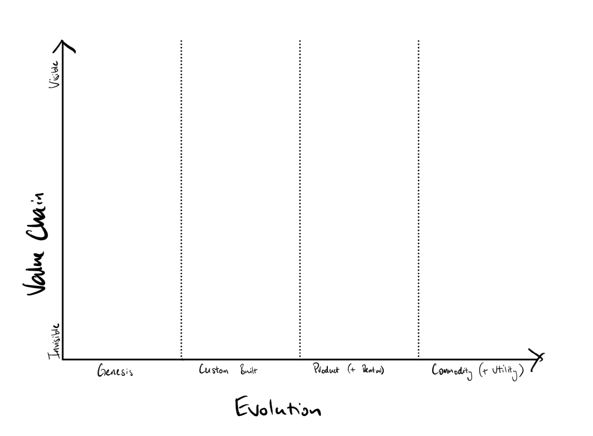

# Wardley Maps Template

I'm just learning my way around this system of mapping. I know there are countless blog posts, websites and tweets from Simon himself on the subject. 

In the spirit of #opensource I thought it would be nice to give back. 

As I'm a huge Noteability user on my iPad I wanted a template that I could install and then be able to map away with my Apple Pencil like the hipster that I am.

It's availble as a PDF file, you could print it out on A4 paper if you wish. 

Wardley Mapping is provided courtesy of [Simon Wardley](https://twitter.com/swardley) and licensed [Creative Commons Attribution Share-Alike](https://creativecommons.org/licenses/by-sa/4.0/).

